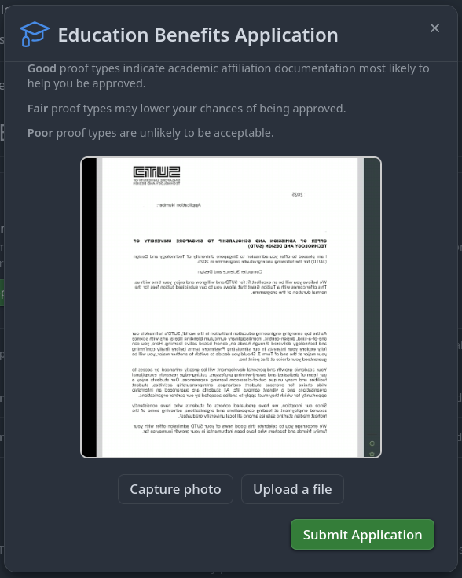

+++
title = "Hacking My Way To Github's Student Developer Pack"
date = 2025-09-18

[taxonomies]
series = []
tags = ["linux", "misc", "all"]
+++

It's time for me to be a student again (on paper anyway), and being a student (or should I say SUTDent) grants me access to [Github's Student Developer Pack](https://education.github.com/pack) for free!
There's just one small problem...

## The Problem

Github has made their verification more stringent. A few years back I only needed to verify my student email, but now I need to:

1. Share location
2. Show proof of enrolment (offer letter, student card, etc.) - you can't upload from your device, Github requires that you snap the photo during the process

What is the problem with this you ask, sounds simple no?
Well, when I tried on my phone:

1. Student card rejected because it was recognised as a debit card (well it is)
2. Photos of my offer letter turned out blurry, even though I was as still as a soldier in a parade.
It looked fine on screen, but after the countdown - 3, 2, 1, boom the picture becomes blurry.
Like what's up man...

## The Solution

### OBS Virtual Capture
I resorted to using my laptop to fix this issue.
On OBS, I used the Virtual Camera feature to use my screen as a dummy webcam to upload my digital offer letter.
As I'm writing, I realise there's an upload button on the desktop website.
I'm a real fool... but I'd still like to share about my experience :v



To get this to work on Linux:
1. Install `v4l2loopback`
2. Enable `v4l2loopback`: `sudo modprobe vl42loopback`
3. In OBS, select the window to capure, then enable Virtual Capture.
By default, the whole screen is captured. The size can be changed in Files > Settings > Video > Base (canvas) resolution.
I changed mine from 1920x1200 to 1000x1200 to capture half the screen where the offer letter is visible.

### `geoclue` Geolocation
My distro doesn't come with geolocation services by default, so I installed `geoclue`.
After I installed it, I updated `/etc/geoclue/geoclue.conf` to update the WiFi-based location services to use
BeaconDB as the provider, since Mozilla Location Services is retired:

```
[wifi]
enabled=true
url=https://beacondb.net/v1/geolocate
```
\
After this was done, I ran `/usr/libexec/geoclue-2.0/demos/agent &` to start the service
and Firefox finally managed to get my location.

- Improvement to be made: convert the `...agent` step into a runit service

## Conclusion
This was a lot of work for the Student Developer pack.
Don't be like me; notice the Upload button and use it, instead of whatever I did.

